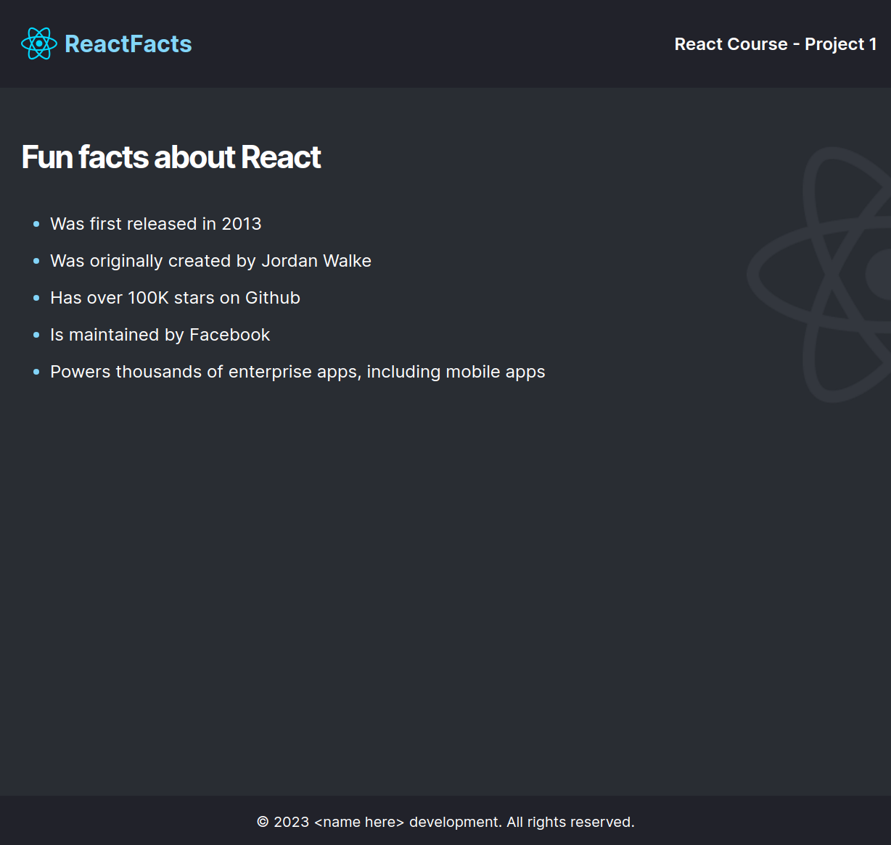
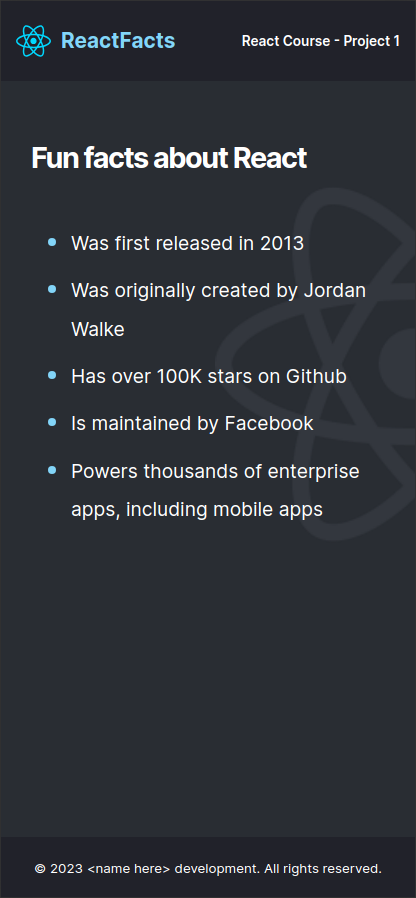

# Scrimba React Project #1: React facts site

The goal of this project was to create a simple static site with facts about React.

I started and finished this project in April 2023.

## Assignment

[Scrimba - Learn React - #1 React facts site](https://scrimba.com/learn/learnreact)

## Technology

- React
- JavaScript
- Vite
- CSS

## Key Concepts

- Vite setup
- React basics
- createRoot API
- JSX
- Custom components

## Links

[Live Demo](https://brightneon7631.github.io/scrimba-react-site/)

[My Other Projects](https://brightneon7631.github.io/odin-scrimba-projects/)

## Screenshots

### Desktop



### Mobile



## Sources

- https://fonts.google.com/specimen/Inter

## Deployment

```bash
# clone repo
git clone

# install project dependencies
npm install

# run vite dev server
npm run dev

# create a production build
npm run build
```